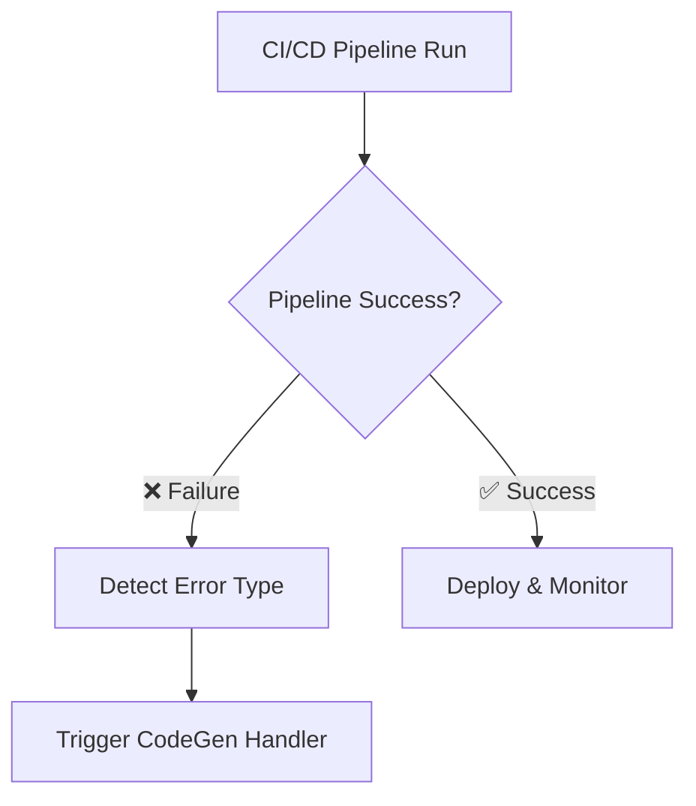
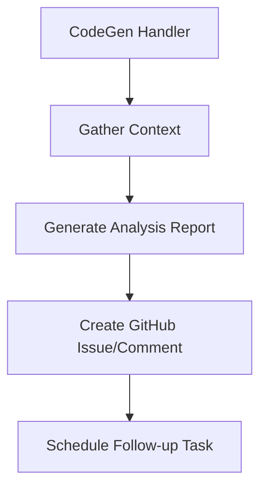
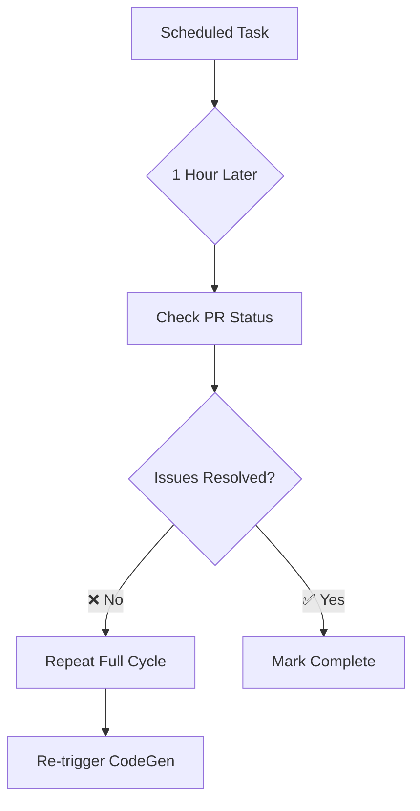

# CodeGen CI/CD Automation System

## 🎯 Overview

This document describes the comprehensive CI/CD automation system with CodeGen integration that ensures 24/7 autonomous development cycles and maintains the highest code quality standards.

## 🚀 System Architecture

### Core Components

```
📁 CI/CD Automation System
├── 🔧 scripts/
│   ├── codegen-error-handler.js    # Smart error analysis & CodeGen integration
│   └── task-scheduler.js          # Delayed task management system
├── 🧪 Testing Infrastructure
│   ├── __tests__/                 # Test suites
│   ├── jest.config.js            # Jest configuration  
│   └── jest.setup.js             # Test environment
├── ⚙️ CI/CD Pipelines
│   ├── .circleci/config.yml      # Enhanced CircleCI with error handling
│   └── .github/workflows/        # GitHub Actions backup pipeline
└── 📊 Monitoring & Reports
    ├── .codegen-reports/         # Error analysis reports
    └── .codegen-tasks/           # Scheduled follow-up tasks
```

## 🔄 Automated Workflow

### 1. Error Detection Phase


### 2. Analysis & Remediation Phase  


### 3. Continuous Monitoring Phase


## 🛠️ Error Handling Coverage

| **Error Type** | **Trigger** | **CodeGen Action** | **Follow-up** |
|---------------|-------------|-------------------|---------------|
| **Linting Failures** | `npm run lint` fails | Fix code style issues | ✅ 1-hour check |
| **Type Errors** | `tsc --noEmit` fails | Resolve TypeScript issues | ✅ 1-hour check |
| **Build Failures** | `npm run build` fails | Fix compilation errors | ✅ 1-hour check |
| **Test Failures** | `jest` tests fail | Write/fix failing tests | ✅ 1-hour check |
| **Security Issues** | TruffleHog detects secrets | Remove/encrypt sensitive data | ✅ 1-hour check |
| **Deploy Failures** | Vercel deploy fails | Fix deployment configuration | ✅ 1-hour check |

## 📋 Task Management System

### Delayed Task Structure
```json
{
  "id": "delayed-1758245293693",
  "createdAt": "2025-09-19T01:28:13.693Z", 
  "scheduledFor": "2025-09-19T02:28:13.694Z",
  "type": "pr_readiness_check",
  "status": "scheduled",
  "instructions": "Check PR readiness and repeat cycle if needed",
  "environment": {
    "branch": "feature/codegen-ci-cd-integration",
    "buildNumber": "11",
    "commitSha": "eff9f61",
    "projectName": "claude-code-ui-nextjs"
  }
}
```

### Task Lifecycle
1. **scheduled** → Task created and waiting
2. **executing** → Task running analysis  
3. **completed** → Task finished successfully

## 🎮 Manual Controls

### NPM Scripts
```bash
# Schedule a new 1-hour delayed task
npm run codegen:schedule

# Check and execute any pending tasks
npm run codegen:check

# Clean up old completed tasks (7+ days)
npm run codegen:cleanup

# Run test suite
npm run test
npm run test:coverage  
npm run test:ci

# Code quality checks
npm run lint
npm run lint:fix
npm run type-check
```

### Direct Script Usage
```bash
# Error handler with specific error type
node scripts/codegen-error-handler.js "build_failure" "Next.js build failed"

# Task scheduler commands  
node scripts/task-scheduler.js schedule
node scripts/task-scheduler.js check
node scripts/task-scheduler.js cleanup
```

## 🚨 Emergency Procedures

### When CodeGen Doesn't Respond
1. **Check GitHub Issues**: Look for automated issues with `codegen` label
2. **Review Error Reports**: Check `.codegen-reports/` directory
3. **Manual Trigger**: Run `npm run codegen:check`
4. **Direct Intervention**: Fix issues manually and commit

### When Tasks Are Stuck
```bash
# Check pending tasks
npm run codegen:check

# Force cleanup if needed
npm run codegen:cleanup

# Manually execute a specific task
bash .codegen-tasks/execute-[task-id].sh
```

### Pipeline Health Check
```bash
# Verify all systems
npm run lint && npm run type-check && npm run test && npm run build
```

## 📊 Monitoring & Analytics

### Error Report Structure
```json
{
  "timestamp": "2025-09-19T01:28:13.693Z",
  "project": "claude-code-ui-nextjs", 
  "branch": "feature/branch-name",
  "commit": "abc123",
  "errorType": "build_failure",
  "errorDetails": "Specific error description",
  "context": {
    "packageJson": "...",
    "circleciConfig": "...", 
    "recentCommits": "..."
  }
}
```

### Key Metrics to Monitor
- **Error Resolution Time**: How quickly CodeGen fixes issues
- **Follow-up Success Rate**: Percentage of tasks completed on first retry
- **Pipeline Stability**: Number of consecutive successful builds
- **Code Quality Trends**: Improvement in test coverage and lint scores

## 🔧 Configuration

### CircleCI Environment Variables
```bash
CODEGEN_API_KEY=your_codegen_api_key
GITHUB_TOKEN=your_github_token  
VERCEL_TOKEN=your_vercel_token
SENTRY_AUTH_TOKEN=your_sentry_token
```

### GitHub Actions Secrets
```bash
CODEGEN_API_KEY
GITHUB_TOKEN (auto-provided)
VERCEL_TOKEN
VERCEL_ORG_ID
VERCEL_PROJECT_ID
SENTRY_AUTH_TOKEN
SENTRY_ORG
SENTRY_PROJECT
```

### Security Configuration
- `.trufflehogignore`: Defines patterns to exclude from security scans
- **TruffleHog**: Automatically installed and configured
- **Dependency Scanning**: `npm audit` runs on every build

## 🚀 Best Practices

### For Developers
1. **Trust the System**: Let CodeGen handle failures automatically
2. **Monitor Progress**: Check PR comments for status updates  
3. **Review Changes**: Always review CodeGen's fixes before merging
4. **Provide Context**: Add detailed commit messages for better analysis

### For DevOps/Admin
1. **Monitor Task Queue**: Regularly check `.codegen-tasks/` directory
2. **Review Error Patterns**: Analyze `.codegen-reports/` for trends
3. **Update Configurations**: Keep CI/CD configs in sync with project changes
4. **Backup Strategy**: GitHub Actions provides redundancy for CircleCI

### For Code Quality
1. **Comprehensive Tests**: CodeGen will generate missing tests
2. **Security First**: All secrets detected are automatically flagged
3. **Type Safety**: TypeScript errors trigger immediate CodeGen intervention
4. **Documentation**: System generates usage documentation automatically

## 🔮 Future Enhancements

### Planned Features
- [ ] **Machine Learning**: Learn from past fixes to improve accuracy
- [ ] **Multi-Project Support**: Scale to handle multiple repositories
- [ ] **Custom Rules Engine**: Allow project-specific automation rules
- [ ] **Integration Ecosystem**: Connect with Slack, Linear, Jira, etc.

### Performance Optimizations
- [ ] **Parallel Processing**: Run multiple CodeGen instances simultaneously
- [ ] **Smart Caching**: Cache analysis results to speed up similar issues
- [ ] **Predictive Analysis**: Detect potential issues before they occur
- [ ] **Resource Management**: Optimize task scheduling for minimal overhead

## 📞 Support & Troubleshooting

### Common Issues

**❓ CodeGen not triggering on failures**
```bash
# Check if scripts are executable
chmod +x scripts/*.js

# Verify environment variables
echo $CODEGEN_API_KEY
echo $GITHUB_TOKEN
```

**❓ Tasks not executing after 1 hour**  
```bash
# Manually check pending tasks
npm run codegen:check

# Review task status  
cat .codegen-tasks/*.json | jq '.status'
```

**❓ Build failures not detected**
```bash
# Check CI/CD configuration
grep -r "codegen-error-handler" .circleci/
grep -r "codegen-error-handler" .github/
```

### Getting Help
1. **GitHub Issues**: Create issue with `help` and `codegen` labels  
2. **Error Reports**: Attach relevant files from `.codegen-reports/`
3. **Task Status**: Include output from `npm run codegen:check`
4. **Environment Info**: Provide Node.js, npm, and OS versions

---

**This system transforms your CI/CD pipeline into an intelligent, self-healing development environment. Welcome to the future of automated software development! 🚀**